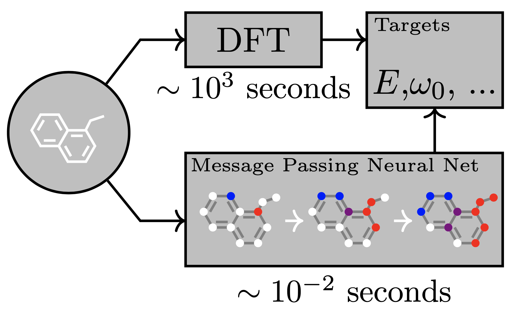

</img>

# Neural Message Passing for Quantum Chemistry - PyTorch

Implementation of [MPNN](https://arxiv.org/abs/1704.01212) for Quantum
Chemistry, in PyTorch.

[Original Code (Tensorflow)](https://github.com/brain-research/mpnn)

[Talk by Justin Gilmer](https://www.youtube.com/watch?v=NJEb5sqjv2w)

## Usage

```python
import torch
from mpnn import MPNN

mpnn = MPNN(
    input_dim=11,
    output_dim=1,
    num_edge_class=5,
    node_dim=50,
    num_propagation_steps=6,
    num_output_hidden_layers=1,
    edge_num_layers=4,
    edge_hidden_dim=50,
    hidden_dim=200,
    activation=torch.nn.ReLU
)

atoms = torch.randn(32, 30, 11) # molecules with up to 30 atoms with 11 features
mask = torch.randint(0, 1, (32, 30)) # whether atom exists in molecule
bonds = torch.randint(0, 5, (32, 30, 30)) # bonds adjacency matrix
distance = torch.randn(32, 30, 30) # pairwise distance


out = mpnn(atoms, bonds, distance, mask) # (32, 1)
```

## Todo

 - [ ] QM9 dataset reader
 - [ ] Basic trainer
 - [ ] [set2set](https://arxiv.org/abs/1511.06391) readout function

## Citations

```bibtex
@inproceedings{gilmer2017neural,
  title={Neural message passing for quantum chemistry},
  author={Gilmer, Justin and Schoenholz, Samuel S and Riley, Patrick F and Vinyals, Oriol and Dahl, George E},
  booktitle={International conference on machine learning},
  pages={1263--1272},
  year={2017},
  organization={PMLR}
}
```
